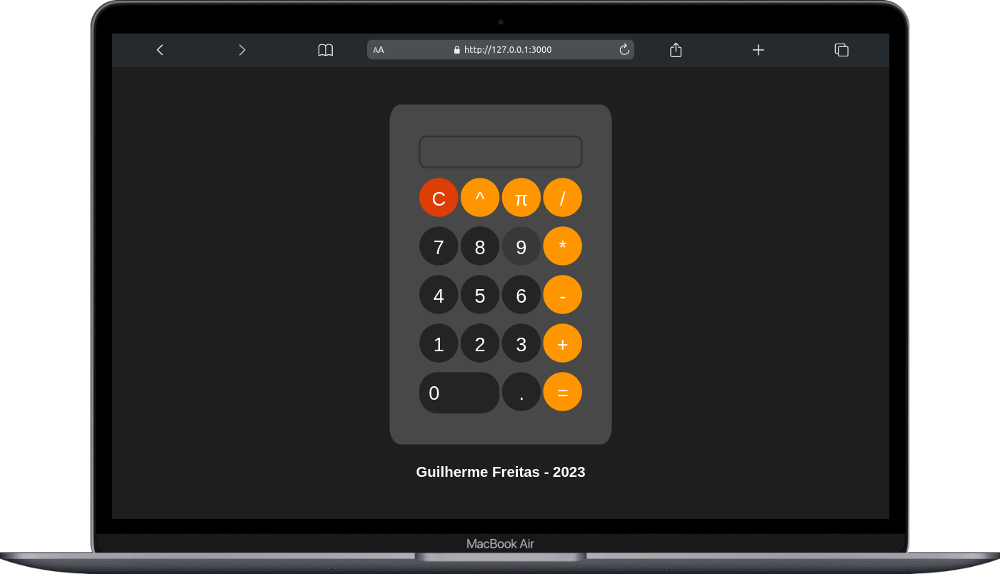
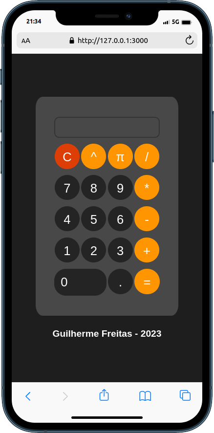

# Calculator - EN 🇺🇸/🇬🇧
## https://calculator-srfreitass.vercel.app/ 
A simple and easy-to-use calculator, created with HTML, CSS, and JS.

## Features 🌟
Here are some of the features of the calculator:

- Addition (+)
- Subtraction (-)
- Division (/)
- Multiplication (*)
- Exponentiation (^)
- Pi (π)
- Clear (C)

## Calculator Layout 🎨
The calculator layout is simple and minimalist, with a large and easy-to-read screen. The buttons are clearly labeled and easy to press. The clean and modern design makes the calculator easy to use and pleasing to the eyes.

  

    
<b>🖥️ Desktop</b>

    
  

  

    
<b>📱 Mobile</b>

    
  

## How to Use 🧐
1. Open the index.html file in your web browser.
2. Use the calculator buttons to perform basic calculations.

## Customization ✍️
If you want to customize the calculator, you can make changes to the CSS file. You can change the colors, fonts, and even the layout to suit your taste.

# Calculadora - PT-BR 🇧🇷/🇵🇹

#### Uma calculadora simples e fácil de usar, criada com HTML, CSS e JS.

## Funcionabilidades 🌟

Aqui estão algumas das funcionalidades da calculadora:

- Adição (+)
- Subtração (-)
- Divisão (/)
- Multiplicação (*)
- Potenciação (^)
- Pi (π)
- Limpar (C)

## Layout da Calculadora 🎨
O layout da calculadora é simples e minimalista, com uma tela grande e fácil de ler. Os botões são claramente rotulados e fáceis de pressionar. O design limpo e moderno torna a calculadora fácil de usar e agradável aos olhos.

## Como Usar 🧐

1. Abra o arquivo index.html em seu navegador da web.
2. Use os botões da calculadora para realizar cálculos básicos.

## Personalização ✍️

Se você quiser personalizar a calculadora, pode fazer alterações no arquivo CSS. Você pode mudar as cores, as fontes e até mesmo o layout para se adequar ao seu gosto.

